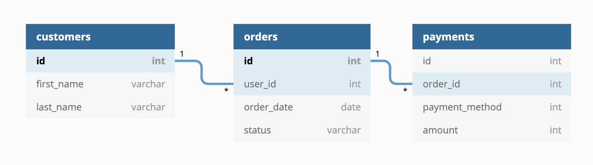

# dbt Project: `dbt_jaffle_shop`


## Tools
- Python 3.9
- Library: dbt-sqlite

## Install Library
```bash
pip install dbt-sqlite
```

## เริ่มสร้าง Project
```bash
dbt init jaffle_shop
```
dbt จะสร้าง Folder ที่จำเป็นมาให้เลย
```bash
├── jaffle_shop
│   ├── analyses
│   ├── macros
│   ├── models
│   ├── seeds
│   ├── snapshots
│   ├── tests
|   ├── dbt_project.yml
|   ├── README.md
```

## ตั้งค่า Config your profiles
config file `Users/your_name/.dbt/profiles.yml`
```yml
jaffle_shop:
  outputs:
    dev:
      type: sqlite
      threads: 1
      database: <database name>
      schema: 'main'
      schemas_and_paths:
        main: 'your_path\dbt_jaffle_shop\jaffle_shop.db'
      schema_directory: 'dbt_jaffle_shop'
      # extensions:
      #   - '/path/to/sqlite-digest/digest.so'
  target: dev
```
## ตรวจสอบว่า Connect SQLite ได้ไหม
```bash
cd .\jaffle_shop\
dbt debug
```


เริ่มใช้ dbt ได้เลย

## ER Diagram
